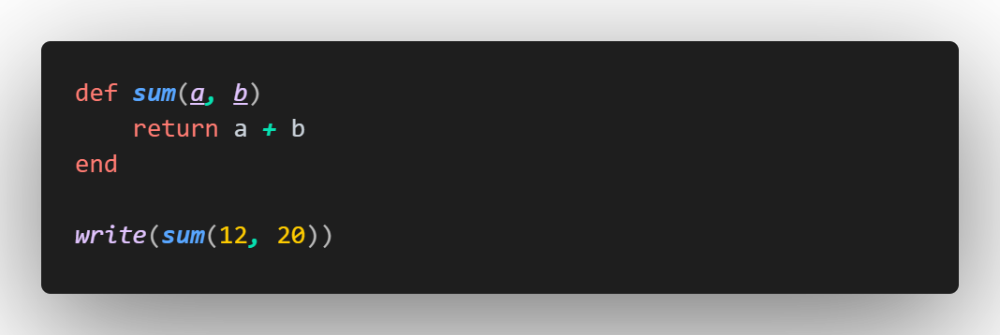

# Nexus README

**Nexus** is a programming language created in Brazil. It is a *simple* programming language with not much access to features such as `classes`. 
The language was created as a project to *"test"* my skills (as MewPlush) and learn something that I wanted to do **since** I learned programming, if you have any **issues**, contact me using those enabled [contacts](#contacts).
Check **more** on [Github](https://github.com/rdb231-com231/Nexus-Lang/tree/GEN2_tests)

---
## Features

This extension adds **support** (syntax *highlighting*, logos, themes, etc) all for the language.

---
## Requirements

Must install Nexus GEN1 or higher of the [Interpreter](https://github.com/rdb231-com231/Nexus-Lang/releases/tag/GEN1)
 
Must install Python 3 or higher [Python](https://www.python.org/downloads/)
 
Must install VS Code 1.98.0 or higher [VS Code 1.98.0](https://code.visualstudio.com/download)

---
## Contacts
- Discord : @mew.plush
- Gmail : mewplushyt@gmail.com
